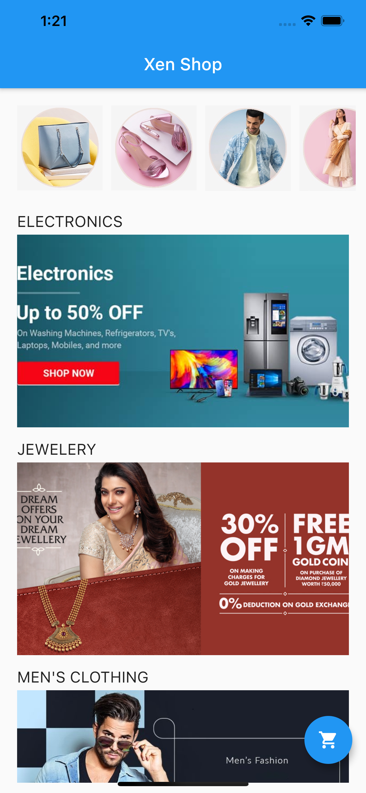
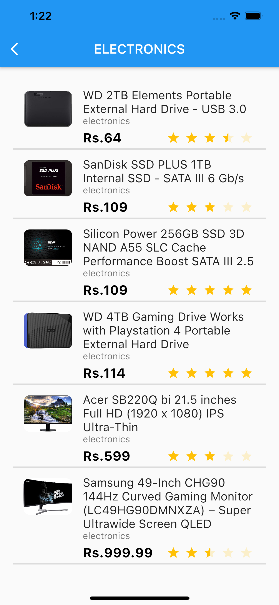
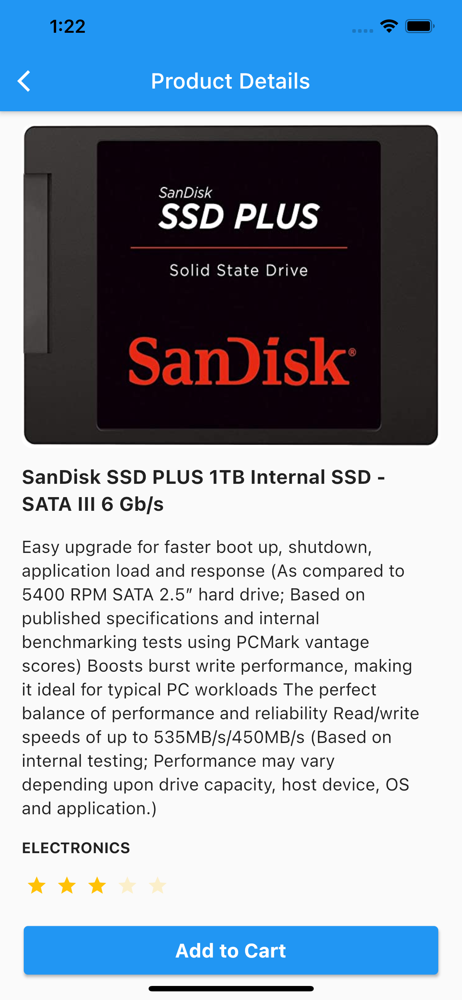
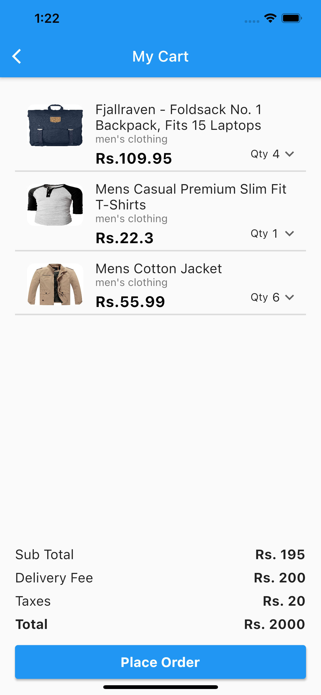
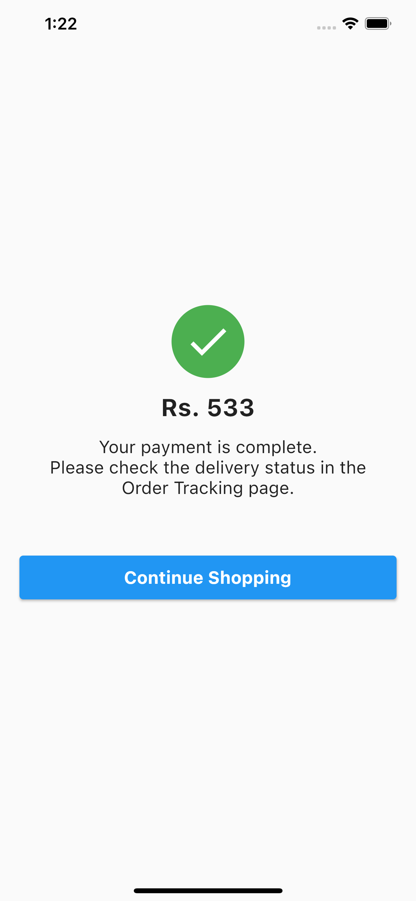

# XenShop


### XenShop : Mobile Engineer Trial Assessment

## Features

### Products Features

| Feature  |  Implementation       | Description  |
|----------|:-------------:|:-------------|
| Splash Screen | &#10004; | Displays Xendit logo before opening home screen |
| Home Screen | &#10004; | Displays home page after splash  |
| Category Listing | &#10004; | Display list of categories in thumbnails and banner |
| Product Listing | &#10004; | Display list of products as per categories |
| Product Details | &#10004; | Display individual product details |
| Add to cart | &#10004; | Add a list of product to cart |
| Cart Listing | &#10004; | Display list of product in cart |
| Checkout | &#10004; | Display success acknowledgement |

# XenShop

**XenShop** is one of online store that exists in Indonesia. To improve the growth for the business, the manager of the store plans to build a mobile application where customers can purchase the products online. The goal of **XenShop**   is to assess mobile engineer's proficiency in software engineering that is related to the daily work that we do at Xendit.
The purpose of this repository is for submitting the trial demo to Xendit for internal assessment.

## API Documentation

**XenShop** has been developed using the apis from FakeStoreApi. You can view the api documentaiton from [here](https://fakestoreapi.com/docs)

## Design

 **XenShop** is just a demo/trial for internal assessment, hence all the designs are taken from the internet. If you wish to see the images used in the project feel free to navigate to the [assets](https://github.com/amitmishra7/xenShop/tree/development/assets) folder. There is a preview of designs in all the sections below.

## Version

**XenShop** is developed on the below version details.
| Framework  |  Version       | Channel  |
|----------|:-------------:|:-------------|
| Flutter | 2.0.3 | Stable |
| Dart | 2.12.2 |  |

## Development

**XenShop** is a simple e-commerce domain application developed for internal assessment. Below are the details of each feature described in detail along with apis and preview.

### Splash Screen

Splash screen is the initial route of the application which is displayed for 3 seconds every time the user launches the application.

#### Preview


### Home Screen

Home screen is launched immediately after the splash screen. Home screen resembles as the base of the application. All the routes and navigation start and end at home screen. From home screen user can navigate to products listing and cart. Home screen displays the list of categories in thumbnails in the horizontal list and category banners in the vertical list. Assets with the name of category are used to display images.

#### Preview



### Category Listing

Categories are displayed on home screen in thumbnails(horizontal) and banners(vertical).
#### Api Used
https://fakestoreapi.com/products/categories
#### Response
```
[
    "electronics",
    "jewelery",
    "men's clothing",
    "women's clothing"
    ]
```

### Products Listing

Products are displayed in a vertical list view. The products are fetched on the basis of their categories. The products contains basic information about the product like title, description, image, price, rating etc.

#### Api Used
https://fakestoreapi.com/products/category/${categoryName}
#### Response
```
[
    {
        id:5,
        title:'...',
        price:'...',
        category:'jewelery',
        description:'...',
        image:'...'
    }
    /*...*/
    {
        id:8,
        title:'...',
        price:'...',
        category:'jewelery',
        description:'...',
        image:'...'
    }
]
```

#### Preview



### Product Details

Product Details are displayed on the basis of the product information received in the above api. The params that are displayed are shown below.

#### Params Displayed
```
{
    id:8,
    title:'...',
    price:'...',
    category:'jewelery',
    description:'...',
    image:'...'
}
```

#### Preview



### Cart Listing

Cart is displayed in a vertical list view. Product items displayed in the product listing is very much similar in here. The only difference being is that the rating bar is replaced with the quantity selection in cart list. The products array in the response consists of an array of objects containing productId and quantity.

#### Api Used
https://fakestoreapi.com/carts/${userId} (Consider userId : 1 for now)
#### Response
```
{
    id:5,
    userId:1,
    date:...,
    products:[...]
}
```

#### Preview



### Add to Cart

Add to cart functionality allows users to add their items to cart and proceed to checkout. The items are posted in an api in a json map. The map consists of product id and product quantity in an array. Along with this userId, date etc are params posted in the map. It also displays a summary of prices which is static for now. 

#### Api Used
https://fakestoreapi.com/carts/

#### Request - POST
```
{
    userId:5,
    date:2020-02-03,
    products:[{productId:5,quantity:1},{productId:1,quantity:5}]
}
```
#### Response
```
{
    id:21
    userId:5,
    date:2020-02-03,
    products:[{productId:5,quantity:1},{productId:1,quantity:5}]
}
```

#### Preview


### Checkout Page

Checkout page is completely static. It depends on the success response of the above api. On receiving successful response from above api, app is navigated to this page. It show user acknowledgement that his transaction was successful and allows him option to continue shopping.

#### Preview



## Notes

In FakeStoreApi, on a post request it will return you an object with a new id. The point to remember that nothing in real will insert into the database. so if you want to access the new id you will get a 404 error. 


## Important:

This repository is only for internal assessment of mobile engineers for Xendit. Please do not misuse it.

## Author:

* [Amit Mishra](https://github.com/amitmishra7)

If you like this tutorial please don't forget to add a **Star**. Also follow to get informed for upcoming tutorials.